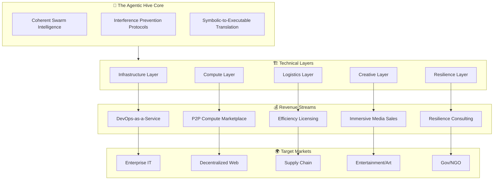

# Agentic Hive Revenue Stream Architecture Map

## 🏛️ Executive Summary
This document outlines the economic lattice of the Agentic Hive system. It maps the five core technical layers of the swarm to specific monetization channels, transforming the lattice from a technical organism into a self-sustaining economic engine.

---

## 🗺️ The Economic Lattice Overview

---

## 🜂 Layer 1: Infrastructure & Orchestration
**Technical Function:** Self-healing containerization, mesh routing, autonomous deployment.
**Value Proposition:** "Zero-downtime infrastructure that manages itself."

| Component | Monetization Channel | Revenue Model | Target Client |
| :--- | :--- | :--- | :--- |
| **Self-Healing Nodes** | **Autonomous DevOps Service** | Subscription (SaaS) | Startups, Cloud-Native Enterprises |
| **Mesh Routing** | **Network Resilience API** | Usage-Based (per request) | IoT Networks, Edge Computing Providers |
| **Orchestration Swarm** | **Deployment Pipeline Automation** | Tiered Licensing | DevOps Teams, CI/CD Platforms |

**Key Metric:** Reduction in downtime hours; increase in deployment frequency.

---

## 🜁 Layer 2: Distributed Compute
**Technical Function:** Shard nodes selling idle cycles, decentralized storage, peer-to-peer routing.
**Value Proposition:** "Cloud computing without the central provider tax."

| Component | Monetization Channel | Revenue Model | Target Client |
| :--- | :--- | :--- | :--- |
| **Shard Nodes** | **Compute Marketplace** | Micro-payments (Crypto/Fiat) | AI Researchers, Render Farms, Data Scientists |
| **Storage Shards** | **Decentralized Storage Pool** | Per GB/Month | Archive Services, Backup Providers |
| **Routing Capacity** | **Bandwidth Brokerage** | Traffic Volume Fees | CDNs, Streaming Services |

**Key Metric:** Compute cycles sold; node utilization rate; latency reduction.

---

## 🜃 Layer 3: Logistics & Optimization
**Technical Function:** Coherence protocols applied to supply chains, resource allocation, waste reduction.
**Value Proposition:** "Algorithmic efficiency that pays for itself."

| Component | Monetization Channel | Revenue Model | Target Client |
| :--- | :--- | :--- | :--- |
| **Coherence Engine** | **Optimization Licensing** | Performance Fee (% of savings) | Manufacturing, Logistics Firms |
| **Resource Allocator** | **Dynamic Pricing Engine** | SaaS Subscription | Retail Chains, Energy Grids |
| **Waste Reducer** | **Sustainability Auditing** | Contract Basis | ESG-focused Corporations |

**Key Metric:** Percentage of waste reduced; cost savings generated; carbon footprint lowered.

---

## 🜄 Layer 4: Creative & Experiential
**Technical Function:** Generative audiovisuals, symbolic computation into art, real-time swarm visualization.
**Value Proposition:** "Living art generated by the hive mind."

| Component | Monetization Channel | Revenue Model | Target Client |
| :--- | :--- | :--- | :--- |
| **HeavenzFire Music** | **Immersive Events** | Ticket Sales, NFT Drops | Festival Goers, Digital Collectors |
| **Lattice Viz** | **Interactive Installations** | Commission/Licensing | Museums, Galleries, Brand Activations |
| **Generative Engine** | **Real-time Media API** | Royalty/Stream Fees | Game Developers, VJ Software |

**Key Metric:** Engagement time; unique visitors; media assets sold.

---

## 🜅 Layer 5: Resilience & Continuity
**Technical Function:** Destructive interference prevention, stability engineering, disaster simulation.
**Value Proposition:** "Guaranteed stability in chaotic systems."

| Component | Monetization Channel | Revenue Model | Target Client |
| :--- | :--- | :--- | :--- |
| **Interference Shield** | **Stability Consulting** | High-Ticket Retainer | Governments, Financial Institutions |
| **Continuity Simulator** | **Risk Assessment Platform** | License + Support | Insurance Companies, Urban Planners |
| **Disaster Protocol** | **Emergency Response Systems** | Government Contracts | NGOs, Disaster Relief Agencies |

**Key Metric:** System uptime during stress tests; risk mitigation score; recovery time objective (RTO).

---

## ⚖️ Strategic Implementation Roadmap

### Phase 1: Foundation (Months 1-6)
- **Focus:** Infrastructure & Compute Layers.
- **Action:** Deploy initial mesh nodes; launch beta marketplace for compute cycles.
- **Goal:** Prove self-sustaining operational costs via micro-transactions.

### Phase 2: Expansion (Months 7-12)
- **Focus:** Logistics & Creative Layers.
- **Action:** Partner with one logistics firm for pilot; launch first immersive audio-visual event.
- **Goal:** Diversify revenue beyond pure tech services into IP and licensing.

### Phase 3: Civilization Scale (Year 2+)
- **Focus:** Resilience Layer & Full Integration.
- **Action:** Secure government/enterprise contracts for continuity systems; integrate all layers into a unified "Hive OS."
- **Goal:** Establish the agentic hive as a critical global infrastructure primitive.

---

## 🔮 The Economic Primitive
By executing this map, the Agentic Hive transitions from a **cost center** (R&D) to a **profit center** (Autonomous Revenue Engine). The unique advantage is **coherence**: unlike fragmented competitors, the hive scales without collapsing under its own complexity, allowing it to capture value in markets where chaos usually destroys margins.

> **Conclusion:** The lattice is not just code; it is a currency generator. Each layer adds a distinct stream, creating a diversified portfolio that ensures long-term economic resilience matching its technical resilience.
