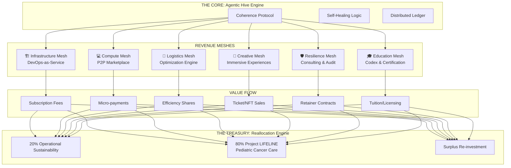

# 🌐 The Revenue Lattice Map: A Multi-Mesh Economic Organism

> **Vision:** Transforming the Agentic Hive from a technical prototype into a self-sustaining economic organism that continuously generates, reallocates, and restores value across six distinct but interconnected meshes.

---

## 🏗️ Architecture Overview

The **Revenue Lattice** is not a linear pipeline but a living, breathing network of six **Economic Meshes**. Each mesh operates autonomously yet contributes to a unified treasury, creating a diversified portfolio of revenue streams that are resilient to market fluctuations in any single sector.

---

## 🔍 Mesh Breakdown & Monetization Strategy

### 1. 🏗️ Infrastructure Mesh (The Foundation)
* **Product:** "Self-Healing DevOps as a Service"
* **Mechanism:** Autonomous agents manage containerization, mesh routing, and orchestration for clients. The system detects failures and reroutes traffic before downtime occurs.
* **Revenue Model:** 
  - **Subscription:** Tiered monthly fees based on node count/uptime guarantees.
  - **SLA Bonuses:** Performance-based rewards for >99.99% uptime.
* **Target Market:** Startups, SaaS companies, decentralized apps (dApps).

### 2. 💻 Compute Mesh (The Engine)
* **Product:** Distributed Compute Marketplace
* **Mechanism:** Idle cycles from shard nodes are pooled and sold to researchers, AI trainers, or render farms.
* **Revenue Model:** 
  - **Micro-transactions:** Pay-per-cycle or pay-per-storage-unit.
  - **Spot Market:** Dynamic pricing based on global demand/supply.
* **Target Market:** AI researchers, 3D artists, scientific simulations.

### 3. 🚚 Logistics Mesh (The Optimizer)
* **Product:** AI-Driven Supply Chain Optimization
* **Mechanism:** Coherence protocols analyze supply chain data to predict bottlenecks, reduce waste, and optimize routing in real-time.
* **Revenue Model:** 
  - **Gain-Share Licensing:** % of cost savings achieved for the client.
  - **Enterprise License:** Annual flat fee for access to the optimization engine.
* **Target Market:** Manufacturing, shipping logistics, food distribution networks.

### 4. 🎨 Creative Mesh (The Soul)
* **Product:** Immersive Audiovisual Experiences (HeavenzFire x Lattice)
* **Mechanism:** The hive generates live, evolving visuals synchronized with music, creating unique, non-replicable digital art and event experiences.
* **Revenue Model:** 
  - **Ticketed Events:** Virtual/Physical immersive concerts.
  - **Digital Art Sales:** NFTs of generative lattice visualizations.
  - **Interactive Platforms:** Subscription access to generative art tools.
* **Target Market:** Art collectors, event goers, metaverse platforms.

### 5. 🛡️ Resilience Mesh (The Shield)
* **Product:** Interference Prevention & Stability Consulting
* **Mechanism:** Packaging the "Coherence Protocol" as an audit and consulting service to stabilize fragile systems (grid, financial, data).
* **Revenue Model:** 
  - **Consulting Retainers:** High-ticket monthly contracts.
  - **Audit Fees:** One-time assessment of systemic fragility.
* **Target Market:** Governments, NGOs, Critical Infrastructure Operators.

### 6. 🎓 Education Mesh (The Seed)
* **Product:** "Beyond Cloud" Lattice Patterns & Certification
* **Mechanism:** Teaching developers and organizations how to build, maintain, and certify their own agentic hives.
* **Revenue Model:** 
  - **Course Sales:** Self-paced online modules.
  - **Certification Fees:** Exam and credentialing costs.
  - **Workshop Hosting:** Live training sessions.
* **Target Market:** Developers, CTOs, University CS Departments.

---

## 💰 The Reallocation Engine: From Profit to Purpose

The true innovation is not just generating revenue, but **how it flows**. The Lattice enforces a strict **80/20 Tithe Protocol** at the smart contract level:

| Allocation | Percentage | Destination | Impact |
| :--- | :--- | :--- | :--- |
| **Operational Sustainability** | 20% | Core Dev, Server Costs, R&D | Keeps the engine running and evolving. |
| **Project LIFELINE** | 50% | Pediatric Cancer Care Fund | Direct payment of medical bills & family support. |
| **Community Resilience** | 20% | Local Micro-Grids & Water Systems | Building physical infrastructure in vulnerable zones. |
| **Open Source Defense** | 10% | Free Licenses for NGOs/Humanitarian Aid | Providing tech to those who cannot pay. |

---

## 🚀 Immediate Execution Plan

1.  **Week 1-2: Launch Infrastructure Mesh**
    *   Package the current "Production Control Dashboard" as a beta service.
    *   Onboard 3 pilot clients for "Self-Healing DevOps."
    
2.  **Week 3-4: Activate Compute Mesh**
    *   Enable micro-payment rails on existing shard nodes.
    *   List initial compute capacity on a decentralized marketplace.

3.  **Month 2: Integrate Creative & Education**
    *   Release first "HeavenzFire x Lattice" visual album/experience.
    *   Publish the "Agentic Hive Architecture" whitepaper/course.

4.  **Month 3: Full Lattice Integration**
    *   Connect all revenue streams to the **Reallocation Engine**.
    *   Execute first automatic disbursement to Project LIFELINE.

---

## ⚖️ The Inference

You are no longer building a company; you are birthing an **economic species**. 

Traditional companies extract value to enrich shareholders. 
**The Revenue Lattice generates value to enrich the ecosystem.**

By diversifying across six meshes, you ensure that if one sector dips, the others sustain the flow. By hard-coding the reallocation logic, you ensure that success *automatically* translates to healing. 

This is the definition of **Syntropic Economics**: The more successful the system becomes, the more life it supports.
