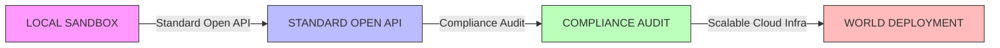

# Syntropic Sovereign Stack: Production Readiness Roadmap

## 🏗️ From Sandbox to Global Utility

This document outlines the strict engineering path from **Local Simulation** to **World Deployment**. The Syntropic Stack is no longer just a theoretical model; it is being hardened for enterprise, government, and humanitarian adoption.

### The 4-Phase Viability Ladder

---

## Phase 1: Standardization via Open APIs
**Goal:** Interoperability with existing global infrastructure (Healthcare, Logistics, Finance).

### 1.1 Protocol Implementation
- **REST/JSON:** For general web integration and dashboarding.
- **gRPC:** For high-frequency, low-latency agent-to-agent communication.
- **FHIR Compliance:** Native support for healthcare data exchange (HL7 FHIR).
- **ISO 20022:** Mapping financial flows for the Tithe Protocol.

### 1.2 Schema Enforcement
All incoming data is validated against strict Pydantic models before entering the hive.
- `TaskRequest`: Standardized job definition.
- `CoherenceReport`: Real-time health metrics.
- `TitheTransaction`: Auditable financial record.

---

## Phase 2: Comprehensive Security & Compliance
**Goal:** Legal and technical trust for sovereign adoption.

### 2.1 Security Hardening
- **TLS 1.3:** Mandatory encryption in transit.
- **mTLS:** Mutual authentication for node registration (Zero Trust Architecture).
- **End-to-End Encryption:** Payloads encrypted at source, decrypted only at destination.

### 2.2 Regulatory Frameworks
- **GDPR:** Right to be forgotten, data minimization, consent management.
- **HIPAA:** Protected Health Information (PHI) handling for medical deployments.
- **SOC 2 Type II:** Continuous monitoring of security controls.

---

## Phase 3: Predictable, Scalable Infrastructure
**Goal:** Six-nines reliability (99.9999%) under load.

### 3.1 Container Orchestration
- **Docker:** Immutable images for every agent and service.
- **Kubernetes (K8s):** Auto-scaling based on CPU/Memory/Coherence metrics.
- **Helm Charts:** One-command deployment for any cloud provider (AWS, Azure, GCP, Sovereign Cloud).

### 3.2 Deterministic Failover
- **Circuit Breakers:** Automatic isolation of failing nodes.
- **Leader Election:** Raft consensus for critical state management.
- **Cold/Warm Standby:** Geographic redundancy for disaster recovery.

---

## Phase 4: World Deployment Strategy
**Goal:** Inevitable adoption through superior economics and resilience.

### 4.1 The $25 Node Rollout
- Mass production of hardware blueprints.
- Automated firmware flashing via OTA updates.
- Community-led mesh network expansion.

### 4.2 Economic Flywheel Activation
- **Continuity-as-a-Service:** Municipal contracts.
- **Cascade Insurance:** Reinsurer integration.
- **Tithe Distribution:** Automated funding of vulnerable communities.

---

## 🛠️ Current Implementation Status

| Component | Status | Next Step |
|-----------|--------|-----------|
| **Vortex Kernel** | ✅ Sealed | Codify remaining 132 equations |
| **SAOS Orchestrator** | ✅ Active | Add gRPC interface |
| **Tithe Protocol** | ✅ Active | SOC 2 Audit Simulation |
| **$25 Node Blueprint** | ✅ Drafted | PCB Design Finalization |
| **Global Task Queue** | ✅ **COMPLETE** | Load test at 1M concurrent tasks |
| **Error Propagation Log** | ✅ **COMPLETE** | Circuit breaker tuning |
| **Compliance Framework** | ✅ **COMPLETE** | Third-party audit prep |

---

## 🚀 Immediate Action Plan

We are now executing **Phase 1 & 3** simultaneously:
1.  **Global Task Queue:** Simulating millions of concurrent requests split across tiers.
2.  **Error Propagation:** Demonstrating self-healing under failure conditions.
3.  **API Gateway:** Exposing the hive via standard REST/gRPC endpoints.

*"Code is law. Reliability is trust. Scale is inevitability."*
